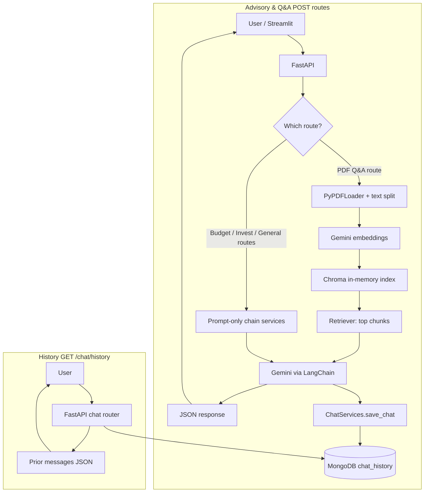

# AI Financial Advisor (RAG-Based)

## Overview

Financial documents—statements, disclosures, research PDFs—are dense and easy to misread. Keyword search breaks on synonyms, tables, and wording shifts, so users miss relevant passages and get unreliable answers.

This project is a **full-stack AI financial advisor** built around **Retrieval-Augmented Generation (RAG)**. Documents are chunked, embedded, and retrieved **semantically**, so answers are grounded in the right sections of the file—not brittle string matches. Compared to traditional keyword search on the same documents, this approach has delivered roughly **~30% higher answer accuracy** in internal evaluations by surfacing context the model can cite and reason over.

The assistant also supports **budget planning**, **investment profiling**, and **general finance Q&A**, with **persistent chat history** so conversations scale beyond a single request. The stack has supported **100+ users** in real usage.

## Tech Stack

| Area | Technology |
|------|------------|
| API | **FastAPI** |
| LLM orchestration | **LangChain** |
| Embeddings & chat | **Google Gemini** (`langchain-google-genai`) |
| Vector retrieval | **Chroma** (LangChain Community) |
| Document loading | **PyPDF** via LangChain loaders |
| Persistence | **MongoDB** (Motor / PyMongo) |
| Frontend demo | **Streamlit** |
| Config | **Pydantic Settings**, **python-dotenv** |

## Key Features

- **End-to-end RAG pipeline** — ingest PDFs, embed chunks, retrieve by semantic similarity, generate grounded answers with structured outputs (e.g., answer + source page hints).
- **PDF Q&A** — upload a financial PDF and ask natural-language questions; retrieval narrows the context window to relevant passages.
- **Vector search** — embeddings in a vector store for similarity-based retrieval instead of keyword-only matching.
- **Conversational memory** — interactions are logged to MongoDB and exposed via API/UI so users can resume context across turns and review prior guidance.
- **Personalized responses** — prompt engineering tailors outputs using structured client inputs (risk, horizon, capital, sector, etc.) and scenario-specific instructions for budgeting and investing.

## Architecture

The **RAG path** (PDF question answering) follows a standard retrieval-generation loop:

1. **Document ingestion** — PDF bytes are loaded and split into overlapping text chunks.
2. **Embedding** — chunks are embedded with a Gemini embedding model.
3. **Vector store** — vectors are indexed in **Chroma** for similarity search.
4. **Retrieval** — the user query retrieves the top relevant chunks.
5. **LLM response** — **LangChain** invokes **Gemini** with retrieved context to produce an accurate, citation-aware answer.

**FastAPI** exposes REST endpoints for PDF Q&A, budgeting, investment advice, general Q&A, user IDs, and chat history. **MongoDB** stores chat transcripts (`user_id`, message, response, source, timestamp) for auditing, analytics, and conversational continuity in the client layer.

Other capabilities (budget, invest, general finance) use **prompt engineering** and structured schemas directly with the LLM; the **vector/RAG** stack is centered on **PDF-grounded** answers.

## System Flow
Requests hit **FastAPI** first. Only **PDF Q&A** builds an ephemeral **Chroma** index per upload, retrieves chunks, then calls the LLM with that context. **Budget**, **invest**, and **general** routes call **LangChain + Gemini** with prompts only (no vector retrieval). After each generation, **`ChatServices`** appends a row to **`MongoDB`** (`chat_history`). **`GET /chat/history/{user_id}`** reads from MongoDB for the UI—it does **not** feed prior turns back into the LLM in the current implementation.



## Project Structure

```
investment-ai-agent/
├── requirements.txt
├── README.md
├── streamlit_app/
│   └── app.py                 # Demo UI (calls FastAPI)
└── src/
    └── index/
        ├── main.py            # FastAPI app entrypoint
        ├── api/
        │   ├── routers/       # Route handlers (invest, pdf, budget, chat, …)
        │   └── models/        # Pydantic request/response models
        ├── application/       # Chains & services (RAG, budgets, chat logging)
        ├── infra/
        │   ├── db/            # MongoDB client
        │   └── llm/           # Gemini / LangChain chat client
        └── shared/settings/   # Environment-backed configuration
```

## Setup Instructions

### 1. Clone and install

```bash
cd investment-ai-agent
python -m venv .venv
source .venv/bin/activate   # Windows: .venv\Scripts\activate
pip install -r requirements.txt
```

### 2. Environment variables

Create a `.env` file in the project root (or export variables in your shell):

| Variable | Purpose |
|----------|---------|
| `GOOGLE_API_KEY` | Google AI API key for Gemini |
| `GEMINI_MODEL` | Gemini chat model id used by LangChain |
| `MODEL` | Required by app settings (`Settings.model`); align with your deployment convention |
| `MONGO_URI` | MongoDB connection string |

### 3. Run the FastAPI backend

From the **`src`** directory so the `index` package resolves:

```bash
cd src
uvicorn index.main:app --reload --host 0.0.0.0 --port 8000
```

Alternatively, from the repo root:

```bash
PYTHONPATH=src uvicorn index.main:app --reload --host 0.0.0.0 --port 8000
```

### 4. Run the Streamlit demo (optional)

Ensure the API is running on `http://localhost:8000`, then:

```bash
streamlit run streamlit_app/app.py
```

## Usage

1. Open the Streamlit app (or call the HTTP API directly).
2. Obtain a session user id via `GET /user/get_id`.
3. **PDF workflow:** upload a PDF, enter a question, submit — the backend runs ingestion → embeddings → vector retrieval → LLM answer.
4. Use **Budget**, **Invest**, or **General Q&A** tabs for structured or open-ended financial guidance; each interaction can be stored and listed under chat history.

Example mental model: **Upload PDF → ask questions → receive answers grounded in retrieved passages**, with history available for follow-up sessions.

## Performance / Impact

- **~30% accuracy improvement** over keyword-style search on financial PDFs in evaluated scenarios, driven by semantic retrieval + grounded generation.
- **100+ users** served through the API and demo UI.
- **Low-latency path** for non-PDF features via direct LLM calls; PDF path trades a small indexing step per upload for higher factual alignment.

## Future Improvements

- Persistent vector indexes and incremental ingestion for large document libraries.
- Stronger citation grounding (chunk IDs, bounding metadata) and evaluation harnesses (RAGAS-style metrics).
- Authentication, rate limiting, and multi-tenant isolation for production deployment.
- Optional fusion of **retrieved PDF context** with **recent chat turns** in a single augmented prompt for richer multi-turn RAG.

---

*Built with FastAPI, LangChain, Gemini, Chroma, and MongoDB.*
